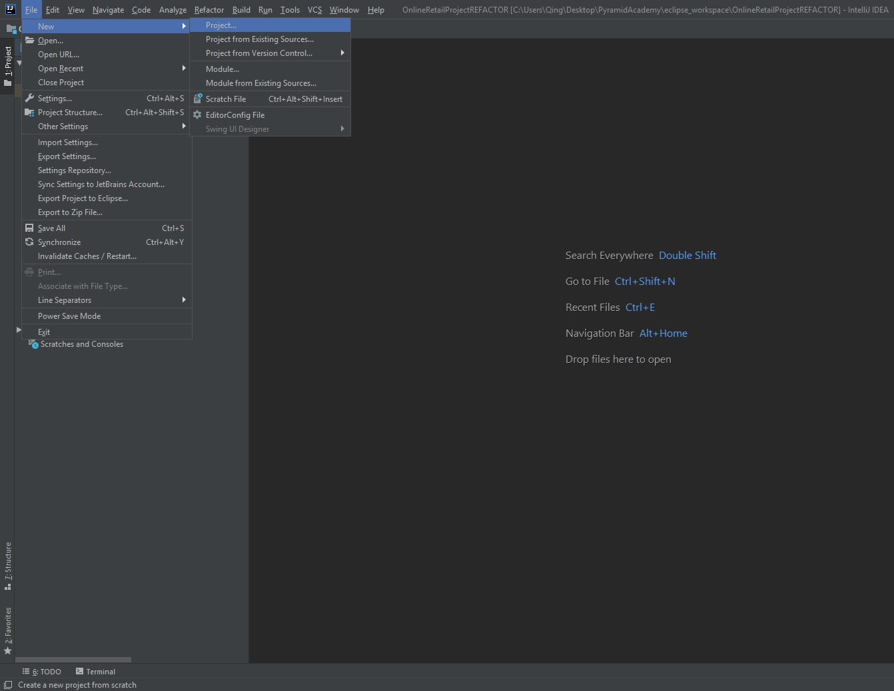
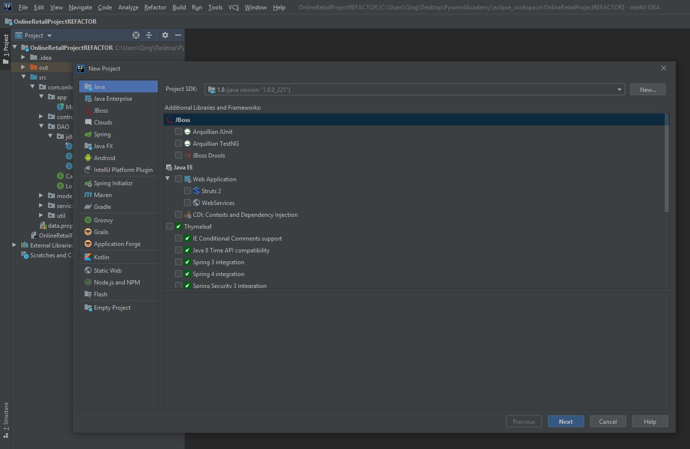
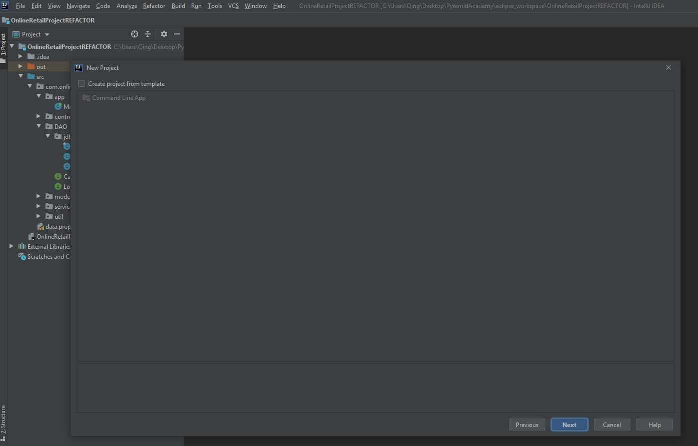
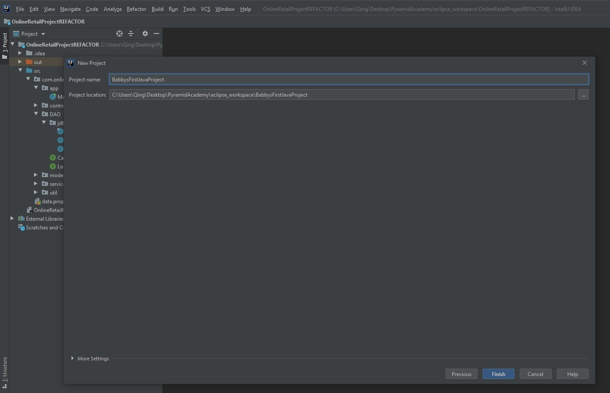
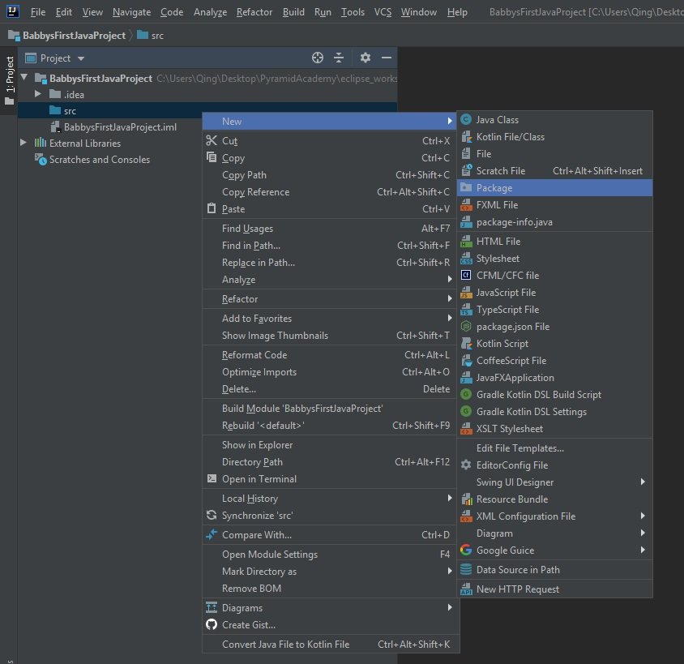
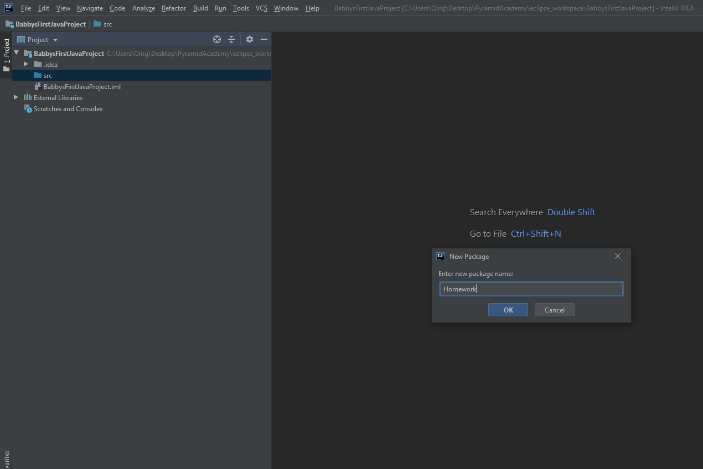
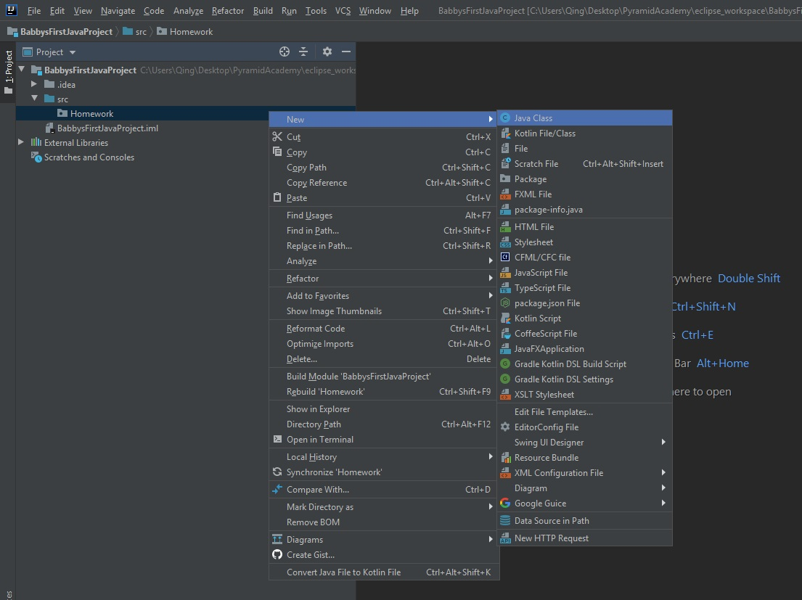
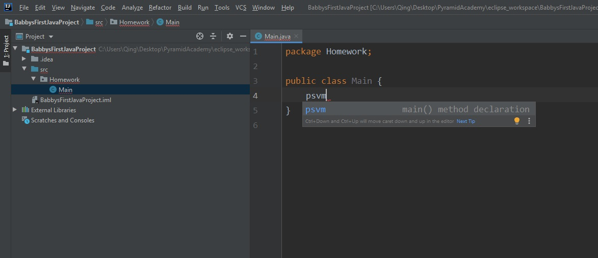
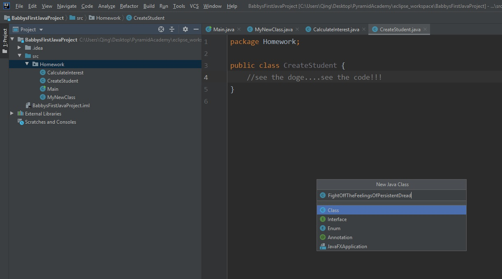

# Babby's First Jabba Project

1. File > New Project
    1. Java should be highlighted in the left panel
    2. Project SDK should be 1.8 (java version "1.8.0_221) or something similar
    3. No additional Libraries and Frameworks need to be selected (for now)
2. Click Next
    1. No projects need to be created from a template (for now)
3. Click Next
    1. Project Name: Follow convention and instansiate a descriptive name
    2. Select Project Location: this dir will instansiate a folder with the project's name
4.  Under ProjectName > src, right-click 
    1. Select New > Package
        1. Follow convention and name Package descriptively: this folder will house all your Java classes
5. Under ProjectName > src > PackageName, right-click
    1. Select New > Java Class
    1. Create a `Main` class
6. The `Main` class should have `package YourPackageName;` on `line 01`, and an empty `public class Main{}`
    1. if using IntelliJ, enter `psvm` to macro a `public static void main(String[] args) {}` `class`
7. Create other classes as necessary following steps 4 - 5.1

# A visual model for adult illiterates

**Open IntelliJ, create a new Project**

**Create a new package under the project**

**Create a Main class, instansiate a psvm in Main**

**Create other classes as necessary**

